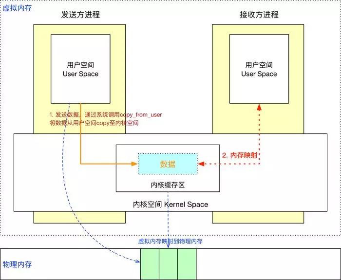

## 谈谈你对 binder 的理解？

面试官提了一个问题，我们来看看 😎、😨 和 🤔️ 三位同学的表现如何吧

------

> 😎 自认为无所不知，水平已达应用开发天花板，目前月薪 10k

**面试官**️：谈谈你对 binder 的理解

😎：binder 是用来跨进程通信的，可以分为 client、server、binder 驱动以及 service manager 四部分。

**面试官**：一次拷贝原理知道吗？

😎：不太清楚，其实对应用开发来说，没必要知道的。

**面试官**：好的，回去等通知吧

------

> 😨 业余时间经常打游戏、追剧、熬夜，目前月薪 15k

**面试官**：谈谈你对 binder 的理解

😨：binder 是一种 IPC 方式，相比于 Linux 原有的管道、共享内存、Socket 等，它通过 mmap 实现一次拷贝，比 Socket 、管道传输速度更快，比共享内存更安全可控，是 Android 系统中主要的 IPC 通信方式。

**面试官**：Intent 传参有大小限制，这跟 binder 有关系吗？

😨：嗯... 应该有关系吧

**面试官**：binder 是如何限制这个大小的？

😨：这个不了解，我还没有深入看过相关源码。

**面试官**：好的，回去等通知吧

------

> 🤔️ 坚持每天学习、不断的提升自己，目前月薪 30k

**面试官**：谈谈你对 binder 的理解

🤔️：binder 是 Android 中主要的跨进程通信方式，binder 驱动和 service manager 分别相当于网络协议中的路由器和 DNS，并基于 mmap 实现了 IPC 传输数据时只需一次拷贝。

binder 包括 BinderProxy、BpBinder 等各种 Binder 实体，以及对 binder 驱动操作的 ProcessState、IPCThreadState 封装，再加上 binder 驱动内部的结构体、命令处理，整体贯穿 Java、Native 层，涉及用户态、内核态，往上可以说到 Service、AIDL 等，往下可以说到 mmap、binder 驱动设备，是相当庞大、繁琐的一个机制。

我自己来谈的话，一天时间都不够，还是问我具体的问题吧。

**面试官**：基于 mmap 又是如何实现一次拷贝的？

🤔️：其实很简单，我来画一个示意图吧：

Client 与 Server 处于不同进程有着不同的虚拟地址规则，所以无法直接通信。而一个页框可以映射给多个页，那么就可以将一块物理内存分别与 Client 和 Server 的虚拟内存块进行映射。

如图， Client 就只需 copy_from_user 进行一次数据拷贝，Server 进程就能读取到数据了。另外映射的虚拟内存块大小将近 1M (1M-8K)，所以 IPC 通信传输的数据量也被限制为此值。

**面试官**：怎么理解页框和页？ 

🤔️：页框是指一块实际的物理内存，页是指程序的一块内存数据单元。内存数据一定是存储在实际的物理内存上，即页必然对应于一个页框，页数据实际是存储在页框上的。

页框和页一样大，都是内核对内存的分块单位。一个页框可以映射给多个页，也就是说一块实际的物理存储空间可以映射给多个进程的多个虚拟内存空间，这也是 mmap 机制依赖的基础规则。

**面试官**：简单说下 binder 的整体架构吧

🤔️：再来画一个简单的示意图吧，这是一个比较典型的、两个应用之间的 IPC 通信流程图：

​		Client 通过 ServiceManager 或 AMS 获取到的远程 binder 实体，一般会用 **Proxy** 做一层封装，比如 ServiceManagerProxy、 AIDL 生成的 Proxy 类。而被封装的远程 binder 实体是一个 **BinderProxy**。

​	**BpBinder** 和 BinderProxy 其实是一个东西：远程 binder 实体，只不过一个 Native 层、一个 Java 层，BpBinder 内部持有了一个 binder 句柄值 handle。

​	**ProcessState** 是进程单例，负责打开 Binder 驱动设备及 mmap；**IPCThreadState** 为线程单例，负责与 binder 驱动进行具体的命令通信。

​		由 Proxy 发起 transact() 调用，会将数据打包到 Parcel 中，层层向下调用到 BpBinder ，在 BpBinder 中调用 IPCThreadState 的 transact() 方法并传入 handle 句柄值，IPCThreadState 再去执行具体的 binder 命令。

​		由 binder 驱动到 Server 的大概流程就是：Server 通过 IPCThreadState 接收到 Client 的请求后，层层向上，最后回调到 **Stub** 的 onTransact() 方法。

​		当然这不代表所有的 IPC 流程，比如 Service Manager 作为一个 Server 时，便没有上层的封装，也没有借助 IPCThreadState，而是初始化后通过 binder_loop() 方法直接与 binder 驱动通信的。