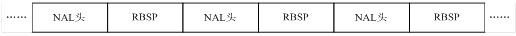
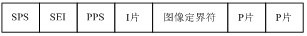
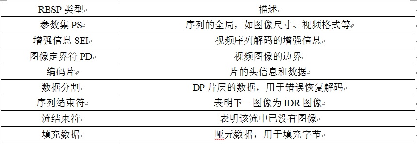
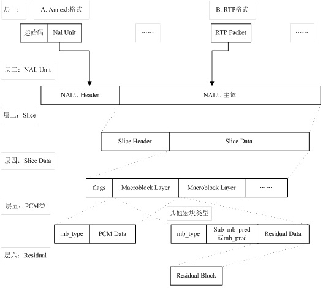
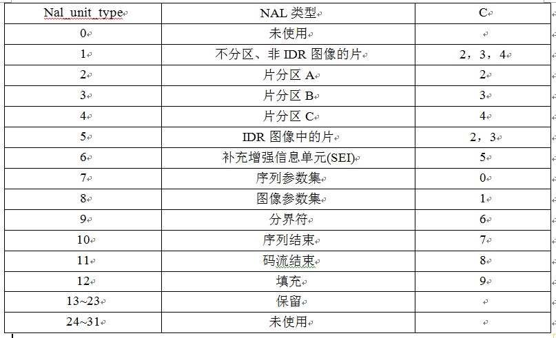
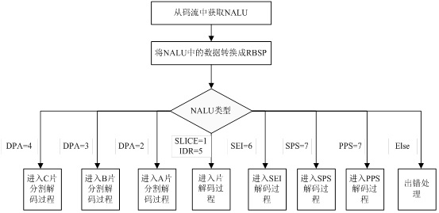

#### 音视频高手课07-视频流H264码流分析实战

#### 1.1 H.264编码格式

H.264的功能分为两层：

> - 视频编码层 
> - 网络提取层 

> H.264 的编码视频序列包括一系列的NAL 单元，每个NAL 单元包含一个RBSP。一个原始的H.264由**N个NALU单元组成**、 NALU 单元常由 [StartCode] [NALU Header] [NALU Payload] 三部分组成，其中 Start Code 用于标示这是一个NALU 单元的开始，必须是"00 00 00 01" 或"00 00 01"。	

​	 

 

#### 1.2 H.264网络传输

​		H.264的编码视频序列包括一系列的**NAL单元**，每个NAL单元包含**一个RBSP**，

见表1。编码片（包括数据分割片IDR片）和序列RBSP结束符被定义为VCL NAL单元，其余为NAL单元。

​		**典型的RBSP单元序列如图2所示。**

RBSP  顺丰 头   顺丰公司尾部

每个单元都按独立的NAL单元传送。单元的信息头（一个字节）定义了RBSP单元的类型，NAL单元的其余部分为RBSP数据。

 

 

1. 2.1 **H.264码流结构图**     

  

起始码：如果NALU对应的Slice为一帧的开始，则用4字节表示，即0x00000001；否则用3字节表示，0x000001。 NAL Header：forbidden_bit，nal_reference_bit（优先级），nal_unit_type（类型）。 脱壳操作：为了使NALU主体不包括起始码，在编码时每遇到两个字节（连续）的0，就插入一字节0x03，以和起始码相区别。解码时，则将相应的0x03删除掉。

 

 H.264解码 **NAL头信息**的nal_referrence_idc（NRI）用于在重建过程中标记一个NAL单元的重要性，

1. 值为0表示这个NAL单元没有用预测，因此可以被解码器抛弃而不会有错误扩散；
2. 值高于0表示NAL单元要用于无漂移重构，且值越高，对此NAL单元丢失的影响越大。
3.  NAL头信息的隐藏比特位，在H.264编码器中默认为0，当网络识别到单元中存在比特错误时，可将其置为1。隐藏比特位主要用于适应不同种类的网络环境（比如有线无线相结合的环境）。     

 

NAL单元解码的流程为：首先从NAL单元中提取出RBSP语法结构，然后按照如图4所示的流程处理RBSP语法结构。输入的是NAL单元，输出结果是经过解码的当前图像的样值点。 NAL单元中分别包含了序列参数集和图像参数集。图像参数集和序列参数集在其他NAL单元传输过程中作为参考使用，在这些数据NAL单元的片头中，通过语法元素pic_parameter_set_id设置它们所使用的图像参数集编号；而相应的每个图像参数集中，通过语法元素seq_paramter_set_id设置他们使用的序列参数集编号。

几个例子：

硬解--soc 芯片

软件   ffmpeg

3、 ffmpeg解析H264流程分析

这是一段实际的码流

 

  ffmpeg -i input.mp4 -vcodec h264 -preset fast -b:v 2000k hello.h264 

 
