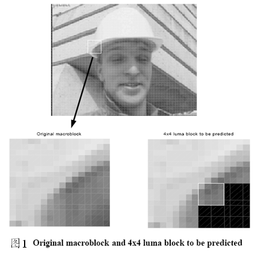
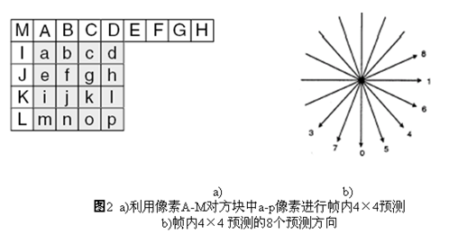
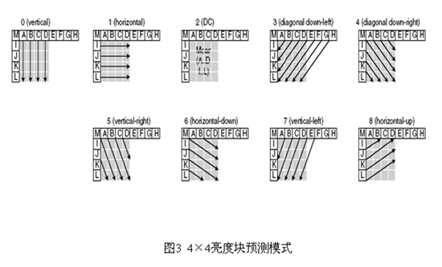
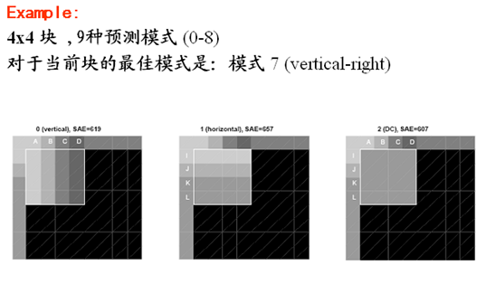
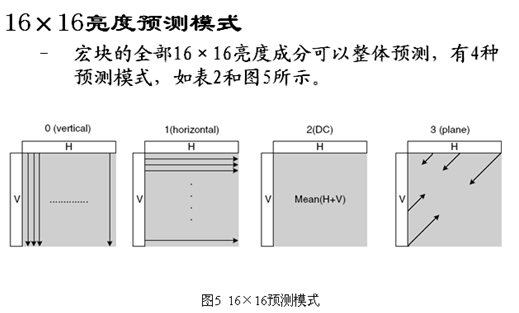
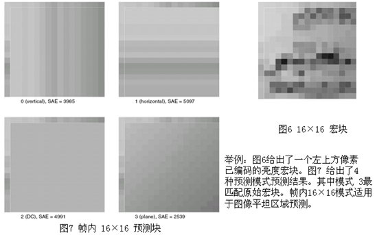
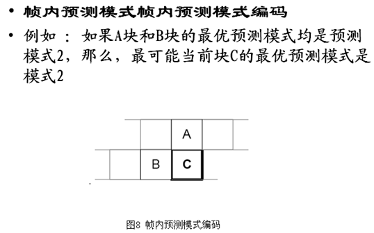
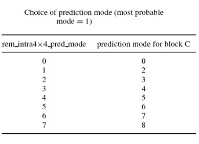

#### H264编码(帧内预测)


> **预测？**总感觉这个词有股神奇的力量,能够将你引向未来
>
> 是不是这样呢~
>
> 那么
>
> 帧内预测是不是力量更大呢
>
> 它又有什么样的作用呢？
>
> 帧内预测可以防止视频产生锯齿现象。

在帧内预测模式中，预测块P是基于已编码重建块和当前块形成的。对亮度像素而言，P块用于4×4子块或者16×16宏块的相关操作。4×4亮度子块有9种可选预测模式，独立预测每一个4×4亮度子块，适用于带有大量细节的图像编码；16×16亮度块有4种预测模式，预测整个16×16亮度块，适用于平坦区域图像编码；色度块也有4种预测模式，类似于16×16亮度块预测模式。编码器通常选择使P块和编码块之间差异最小的预测模式。

 

4×4亮度预测模式

如图6.14所示，4×4亮度块的上方和左方像素A～M为已编码和重构像素，用作编解码器中的预测参考像素。a～p为待预测像素，利用A～M值和9种模式实现。其中模式2(DC预测)根据A～M中已编码像素预测，而其余模式只有在所需预测像素全部提供才能使用。图6.15箭头表明了每种模式预测方向。对模式3～8，预测像素由A～M加权平均而得。例如，模式4中，d=round(B/4+C/2+D/4)。








| 模式                | 描 述                                |
| :------------------ | :----------------------------------- |
| 模式0（垂直）       | 由A、B、C、D 垂直推出相应像素值      |
| 模式1（水平）       | 由I、J、K、L 水平推出相应像素值      |
| 模式2（DC）         | 由A~D 及I~L 平均值推出所有像素值     |
| 模式3（下左对角线） | 由45°方向像素内插得出相应像素值      |
| 模式4（下右对角线） | 由45°方向像素内插得出相应像素值      |
| 模式5（右垂直）     | 由26.6°方向像素值内插得出相应像素值  |
| 模式6（下水平）     | 由26.6°方向像素值内插得出相应像素值  |
| 模式7（左垂直）     | 由26.6° 方向像素值内插得出相应像素值 |
| 模式8（上水平）     | 由26.6° 方向像素值内插得出相应像素值 |







表2 16×16预测模式

 




| 模式          | 描 述                                                        |
| :------------ | :----------------------------------------------------------- |
| 模式0（垂直） | 由上边像素推出相应像素值                                     |
| 模式1（水平） | 由左边像素推出相应像素值                                     |
| 模式2（DC）   | 由上边和左边像素平均值推出相应像素值                         |
| 模式3（平面） | 利用线形“plane”函数及左、上像素推出相应像素值，适用于亮度变化平缓区域 |


8×8色度块预测模式

 

每个帧内编码宏块的8×8色度成分由已编码左上方色度像素预测而得，两种色度成分常用同一种预测模式。

4种预测模式类似于帧内16×16预测的4种预测模式，只是模式编号不同。其中DC（模式0）、水平（模式1）、垂直（模式2）、平面（模式3）。




对于当前块C, 编解码器按照如下方法计算

```
probableprediction mode＝

​          min{prediction mode of A, predictionmodes of B}

当A (或者 B）的预测模式不可用时，

​         prediction mode of A＝ 2.
```

 

例如

  A 和 B块的预测模式分别为 3 和1

```
   most probable mode for block C =1
```


编码器为每个4x4 块发送一个标记 flag,解码器按照如下方式 解码

```
Ifflag==1, prediction mode=most_probable_mode

Ifflag==0

   If rem_intra4×4_pred_mode< most_probable_mode

​     prediction mode=rem_intra4×4_pred_mode

   else

​     prediction mode=rem_intra4×4_pred_mode+1
```

 

这样表示9中预测模式只需要8个值 (0 to 7)


