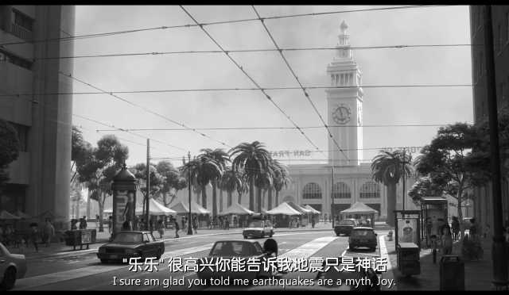
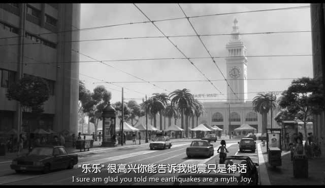
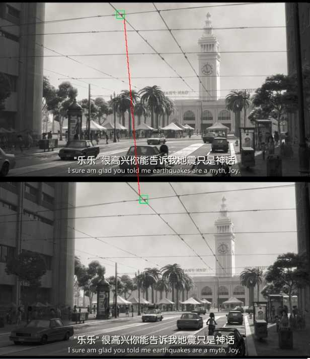
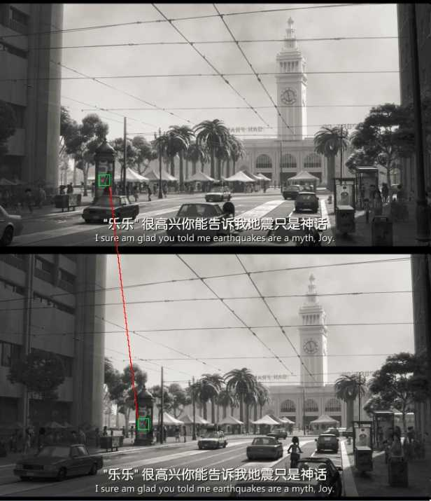
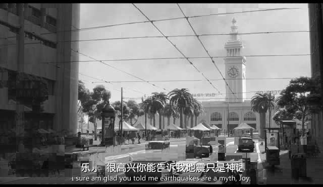

#####    

### 音视频高手课08-H264 I帧 P帧 B帧及手写H264编码器


##### 1  三种帧的说明

1、I 帧：帧内编码帧，帧表示关键帧，你可以理解为这一帧画面的完整保留；解码时只需要本帧数据就可以完成（因为包含完整画面）


**I 帧的特点：**

- a. 它是一个全帧压缩编码帧，它将全帧图像信息进行JPEG压缩编码及传输

- b. 解码时仅用I 帧的数据就可重构完整图像

- c. I 帧描述了图像背景和运动主体的详情

- d. I 帧不需要参考其他画面而生成

- e. I 帧是P帧和B帧的参考帧（其质量直接影响到同组中以后各帧的质量）

- f. I 帧不需要考虑运动矢量

- g. I 帧所占数据的信息量比较大


  、**P帧**：前向预测编码帧。P帧表示的是这一帧跟之前的一个关键帧（或P帧）的差别，解码时需要之前缓存的画面叠加上本帧定义的差别，生成最终画面。（也就是差别帧，P帧没有完整画面数据，只有与前一帧的画面差别的数据）


​    **P帧的预测与重构**：P帧是以 I 帧为参考帧，在 I 帧中找出P帧“某点”的预测值和运动矢量，取预测差值和运动矢量一起传送。在接收端根据运行矢量从 I 帧找出P帧“某点”的预测值并与差值相加以得到P帧“某点”样值，从而可得到完整的P帧。


**P帧的特点：**

- a. P帧是 I 帧后面相隔1~2帧的编码帧

- b. P帧采用运动补偿的方法传送它与前面的I或P帧的差值及运动矢量（预测误差）

- c. 解码时必须将帧中的预测值与预测误差求和后才能重构完整的P帧图像

- d. P帧属于前向预测的帧间编码。它只参考前面最靠近它的 I 帧或P帧

- e. 由于P帧是参考帧，它可能造成解码错误的扩散

- f. 由于是差值传送，P帧的压缩比较高


3、**B帧**：双向预测内插编码帧。B帧是双向差别帧，也就是B帧记录的是本帧与前后帧的差别（具体比较复杂，有4种情况，但我这样说简单些），换言之，要解码B帧。不仅要取得之前的缓存画面，还要解码之后的画面，通过前后画面的与本帧数据的叠加取得最终的画面。B帧压缩率高，但是解码时CPU会比较累。


**B帧的预测与重构**

​    B帧以前面的 I 或P帧和后面的P帧为参考帧，“找出”B帧“某点”的预测值和两个运动矢量，并取预测差值和运动矢量传送。接收端根据运动矢量在两个参考帧中“找出（算出）”预测值并与差值求和，得到B帧“某点”样值，从而可得到完整的B帧。


**B帧的特点：**

- a. B帧是由前面的 I 或P帧和后面的P帧进行预测的

- b. B帧传送的是它与前面的 I 或P帧和后面的P帧之间的预测误差及运动矢量

- c. B帧是双向预测编码帧

- d. B帧压缩比最高，因为它只反映并参考帧间运动主体的变化情况，预测比较准确

- e. B帧不是参考帧，不会造成解码错误的扩散


```
注：I、B、P帧是根据压缩算法的需要，是人为定义的，他们都是实实在在的物理帧。
一般来说，帧的压缩率是7（跟JPG差不多），
P帧是20，B帧可以达到50.可见使用B帧能节省大量空间，
节省出来的空间可以用来保存多一些帧，这样在相同码率下，可以提供更好的画质。
```


 

#### 1.2 压缩算法的说明

**h264的压缩方法**：

- 1、分组：把几帧图像分为一组（GOP，也就是一个序列），为防止运动变化，帧数不宜取多
- 2、定义帧：将每组内各帧图像定义为三种类型，即 I 帧、B帧和P帧

- 3、预测帧：以帧作为基础帧，以帧预测P帧，再由 I 帧和P帧预测B帧

- 4、数据传输：最后将 I  帧数据与预测的差值信息进行存储和传输

​    **帧内**（Intraframe）压缩也称为空间压缩（Spatial compression）。当压缩一帧图像时，仅考虑本帧的数据而不考虑相邻帧之间的冗余信息，这实际上与静态图像压缩类似。帧内一般采用有损压缩算法，由于帧内压缩是编码一个完整的图像，因此可以独立的解码、显示。帧内压缩一般达不到很高的压缩，跟编码jpeg差不多。

​    **帧间**（Interframe）压缩的原理是：相邻几帧的数据有很大的相关性，或者说前后两帧信息变化很小的特点，也即连续的视频及其相邻帧之间具有冗余信息，根据这一特性，压缩相邻帧之间的冗余量就可以进一步提高压缩量，减少压缩比。帧间压缩也称为时间压缩，它通过比较时间轴上不同帧之间的数据进行压缩。帧间压缩一般是无损的。帧差值（Frame differencing）算法是一种典型的时间压缩发，它通过比较本帧与相邻帧之间的差异，仅记录本帧与其相邻帧的差值，这样可以大大减少数据量。

​    **顺便说下有损**（Lossy）压缩和无损（Lossy less）压缩。无损压缩也即压缩前和解压缩后的数据完全一致。多数的无损压缩都采用RLE行程编码算法。有损压缩意味着解压缩后的数据与压缩前的数据不一致。在压缩的过程中要丢失一些人眼和耳朵所不敏感的图像或音频信息，而且丢失的信息不可恢复。几乎所有高压缩的算法都采用有损压缩，这样才能达到低数据率的目标。丢失的数据率与压缩比有关，压缩比越小，丢失的数据越多，解压缩后的效果一般越差。此外，某些有损压缩算法采用多次重复压缩的方式，这样还会引起额外的数据丢失。

-----


### 2  手写H264编码器

要彻底理解视频编码原理，看书都是虚的，需要实际动手，实现一个简单的视频编码器：

知识准备：基本图像处理知识，信号的时域和频域问题，熟练掌握傅立叶正反变换，一维、二维傅立叶变换，以及其变种，dct变换，快速dct变换。 

**2.1.1 第一步：实现有损图像压缩和解压**
		参考 JPEG原理，将RGB->YUV，然后Y/U/V看成三张不同的图片，将其中一张图片分为 8x8的block进行 dct变换（可以直接进行二维dct变换，或者按一定顺序将8x8的二维数组整理成一个64字节的一维数组），还是得到一个8x8的整数频率数据。于是表示图像大轮廓的低频信号（人眼敏感的信号）集中在 8x8的左上角；表示图像细节的高频信号集中在右下角。

​		 接着将其量化，所谓**量化**，就是信号采样的步长，8x8的整数频率数据块，每个数据都要除以对应位置的步长，左上角相对重要的低频信号步长是1，也就是说0-255，是多少就是多少。而右下角是不太重要的高频信号，比如步长取10，那么这些位置的数据都要/10，实际解码的时候再将他们*10恢复出来，这样经过编码的时候/10和解码的时候*10，那么步长为10的信号1, 13, 25, 37就会变成规矩的：0, 10, 20, 30, 对小于步长10的部分我们直接丢弃了，因为高频不太重要。 

​	 	**经过量化以后**，8x8的数据块左上角的数据由于步长小，都是比较离散的，而靠近右下角的高频数据，都比较统一，或者是一串0，因此图像大量的细节被我们丢弃了，这时候，我们用无损压缩方式，比如lzma2算法（jpeg是rle + huffman）将这64个byte压缩起来，由于后面高频数据步长大，做了除法以后，这些值都比较小，而且比较靠近，甚至右下部分都是一串0，十分便于压缩。

​		JPEG图像有个问题就是低码率时 block边界比较严重，现代图片压缩技术往往要配合一些de-block算法，比如最简单的就是边界部分几个像素点和周围插值模糊一下。 

>  做到这里我们实现了一个同 jpeg类似的静态图片有损压缩算法。在视频里面用来保存I帧数据。 

​	 

 **2.1.2 第二步：实现宏块误差计算** 

​		**视频**由连续的若干图像帧组成，分为 I帧，P帧，所谓I帧，就是不依赖就可以独立解码的视频图像帧，而P帧则需要依赖前面已解码的视频帧，配合一定数据才能生成出来。所以视频中I帧往往都比较大，而P帧比较小，如果播放器一开始收到了P帧那么是无法播放的，只有收到下一个I帧才能开始播放。I帧多了视频就变大，I帧少了，数据量是小了，但视频受到丢包或者数据错误的影响却又会更严重。

​		 那么所谓运动预测编码，其实就是P帧的生成过程：继续将图片分成 16x16的block（为了简单只讨论yuv的y分量压缩）。I帧内部单帧图片压缩我们采用了8x8的block，而这里用16x16的block来提高帧间编码压缩率（当然也会有更多细节损失），我们用 x, y表示像素点坐标，而s,t表示block坐标，那么坐标为（x,y）的像素点所属的block坐标为： 

```c
s = x / 16 = x >> 4
t = y / 16 = y >> 4
```


​		 接着要计算两个**block的相似度**，即矢量的距离，可以表示为一个256维矢量（16x16）像素点色彩距离的平方，我们先定义两个颜色的误差为： 

```text
PixelDiff(c1, c2) = (c1- c2) ^ 2
```

​		**那么256个点的误差**可以表示为所有对应点的像素误差和：

```text
BlockDiff(b1, b2) = sum( PixelDiff(c1, c2) for c1 in b1 for c2 in b2)
```


代码化为：

```c
int block_diff(const unsigned char b1[16][16], const unsigned char b2[16][16]) {
    int sum = 0;
    for (int i = 0; i < 16; i++) {
         for (int j = 0; j < 16; j++) {
              int c1 = b1[i][j];
              int c2 = b2[i][j];
              sum += (c1 - c2) * (c1 - c2);
         }
    }
    return sum;
}
```


有了这个block求差的函数，我们就可以针对**特定block**，搜索另外若**干个block**中哪个和它最相似了（误差最小）。

##### 1.2.3 **第三步：实现运动预测编码** 

​		根据上面的宏块比较函数，你已经可以知道两个block到底像不像了，越象的block，block_diff返回值越低。那么我们有两帧相邻的图片，P1，P2，假设 P1已经完成编码了，现在要对 P2进行P帧编码，其实就是轮询 P2里面的每一个 block，为P2中每一个block找出上一帧中相似度最高的block坐标，并记录下来，具体伪代码可以表示为：

```c
unsigned char block[16][16];
for (int t = 0; t <= maxt; t++) {
    for (int s = 0; s <= maxs; s++) {
         picture_get_block(P2, s * 16, t * 16, block); // 取得图片 P2 的 block
         int x, y;
         block_search_nearest(P1, &x, &y, block); // 在P1中搜索最相似的block
         output(x, y);  // 将P1中最相似的block的左上角像素坐标 (x, y) 输出
    }
}
```


​		其中在P1中搜索最相似 block的 block_search_nearest 函数原理是比较简单的，我们可以暴力点用两个for循环轮询 P1中每个像素点开始的16x16的block（速度较慢），当然实际中不可能这么暴力搜索，而是围绕P2中该block对应坐标在P1中位置作为中心，慢慢四周扩散，搜索一定步长，并得到一个 ：**按照一定顺序进行搜索，并且在一定范围内最相似的宏块坐标**。 。


> 于是P2进行运动预测编码的结果就是一大堆(x,y)的坐标，代表P2上每个block在上一帧P1里面最相似的 block的位置。反过来说可能更容易理解，我们可以把第三步整个过程定义为： 


##### 怎么用若干 P1里不同起始位置的block拼凑出图片P2来，使得拼凑以后的结果和P2最像。


**1.2.4 第四步：实现P帧编码**

​		 拼凑的结果就是一系列(x,y)的坐标数据，我们继续用lzma2将它们先压缩起来，按照 vcd的分辨率

352 x 240，我们横向需要 352 / 16 = 22个block，纵向需要 240 / 16 = 15 个block，可以用 P1中 22 x 15 = 330 

个 block的坐标信息生成一张和P2很类似的图片 P2' ： 

```c
for (int t = 0; t < 15; t++) {
    for (int s = 0; s < 22; s++, next++) {
         int x = block_positions[next].x;   // 取得对应 P1上的 block像素位置 x
         int y = block_positions[next].y;   // 取得对应 P1上的 block像素位置 y
         // 将 P1位置(x,y)开始的 16 x 16 的图块拷贝到 P2'的 (s * 16, t * 16)处
         CopyRect(P2', s * 16, t * 16, P1, x, y, 16, 16); 
    }
}
```

 		我们把用来生成P2的P1称为 P2的 “参考帧”，再把刚才那一堆P1内用来拼成P2的 block坐标称为 “**运动矢量**”，这是P帧里面最主要的数据内容。但是此时由P1和这些坐标数据拼凑出来的P2，你会发现粗看和P2很象，但细看会发现有些支离破碎，并且边缘比较明显，怎么办呢？我们需要第四步。
 		

#####  **1.2.5第五步：实现P帧编码** 

 		有了刚才的运动预测矢量（一堆block的坐标），我们先用P1按照这些数据拼凑出一张类似 P2的新图片叫做P2'，然后同P2上每个像素做减法，得到一张保存 differ的图片： 

```c
D2 = (P2 - P2') / 2
```

​		误差图片 D2上每一个点等于 P2上对应位置的点的颜色减去 P2'上对应位置的点的颜色再除以2，用8位表示差值，值是循环的，比如-2就是255，这里一般可以在结果上 + 0x80，即 128代表0，129代表2，127代表-2。继续用一个 8位的整数可以表示 [-254, 254] 之间的误差范围，步长精度是2。 

​		按照第三步实现的逻辑，P2'其实已经很像P2了，只是有些误差，我们将这些误差保存成了图片D2，所以图片D2中，信息量其实已经很小了，都是些细节修善，比起直接保存一张完整图片熵要低很多的。所以我们将 D2用类似第一步提到的有损图片压缩方法进行编码，得到最终的P帧数据：

```text
Encode(P2) = Lzma2(block_positions) + 有损图像编码（D2）
```


​		具体在操作的时候，D2的图像块可以用16x16进行有损编码，因为前面的运动预测数据是按16x16的宏块搜索的，而不用象I帧那样精确的用8x8表示，同时保存误差图时，量化的精度可以更粗一些用不着象I帧那么精确，可以理解成用质量更低的JPEG编码，按照16x16的块进行编码，加上误差图D2本来信息量就不高，这样的保存方式能够节省不少空间。

​	

 **1.2.6 第六步：实现GOP生成** 

​		通过前面的代码，我们实现了I帧编码和P帧编码，P帧是参考P1对P2进行编码，而所谓B帧，就是参考 P1和 P3对P2进行编码，当然间隔不一定是1，比如可以是参考P1和P5对P2进行编码，前提条件是P5可以依赖P1及以前的数据进行解码。

​		 不过对于一个完整的简版视频编码器，I帧和P帧编码已经够了，市面上任然有很多面向低延迟的商用编码器是直接干掉B帧的，因为做实时传输时收到B帧没法播放，之后再往后好几帧收到下一个I或者P帧时，先前收到的B帧才能被解码出来，造成不少的延迟。 

​		而所谓的 GOP (Group of picture) 就是由一系列类似 I, P, B, B, P, B, B, P, B, B P 组成的一个可以完整被解码出来的图像组，而所谓视频文件，就是一个接一个的GOP，每个GOP由一个I帧开头，然后接下来一组连续的P 或者 B构成，播放时只有完整收到下一个GOP的I帧才能开始播放。

 		最后是关于参考帧选择，前面提到的 P2生成过程是参考了 P1，假设一个GOP中十张图片，是 I1, P1, P2, P3, P4, ... P9 保存的，如果P1参考I1，P2参考P1, P3参考P2 .... P9参考P8这样每一个P帧都是参考上一帧进行编码的话，误差容易越来越大，因为P1已经引入一定误差了，P2在P1的基础上误差更大，到了P9的话，图片质量可能已经没法看了。 

​		因此正确的参考帧选择往往不需要这样死板，比如可以P1-P9全部参考I1来生成，或者，P1-P4参考I1来生成，而P5-P9则参考P5来生成，这样步子小点，误差也不算太离谱。

 **1.2.7 第七步：容器组装** 

​		我们生成了一组组编码过的GOP了，这时候需要一定的文件格式将他们恰当的保存下来，记录视频信息，比如分辨率，帧率，时间索引等，就是一个类似MP4（h.264的容器）文件的东西。至此一个简单的小型编码器我们已经完成了，可以用 SDL / DirectX / OpenGL 配合实现一个播放器，愉快的将自己编码器编码的视频播放出来。

**1.2.8第八步：优化改进** 

​		这时候你已经大概学习并掌握了视频编码的基础原理了，接下来大量的优化改进的坑等着你去填呢。优化有两大方向，编码效率优化和编码性能优化：前者追求同质量（同信噪比）下更低的码率，后者追求同样质量和码率的情况下，更快的编码速度。

​		 有这个基础后接下来可以回过头去看JPEG标准，MPEG1-2标准，并阅读相关实现代码，你会发现简单很多了，接着肯H.264代码，不用全部看可以针对性的了解以下H.264的I帧编码和各种搜索预测方法，有H.264的底子，你了解 HEVC和 vpx就比较容易了。 

​		参考这些编码器一些有意思的实现来改进自己的编码器，试验性质，可以侧重原理，各种优化技巧了解下即可，本来就是hack性质的。

>  		有卯用呢？首先肯定很好玩，其次，当你有需要使用并修改这些编码器为他们增加新特性的时候，你会发现前面的知识很管用了。 

------有朋友说光有代码没有图片演示看不大明白，好我们补充一下图片演示：

#### 1.3 画面演示

1. ##### 3.1 这是第一帧画面：P1（我们的参考帧） 




 **这是第二帧画面：P2（需要编码的帧）** 




> 从视频中截取的两张间隔1-2秒的画面，和实际情况类似，下面我们进行几次运动搜索：

#####  1.3.2 搜索演示1：搜索P2中车辆的车牌在P1中最接近的位置（上图P1，下图P2） 


这是一个**演示程序**，鼠标选中P2上任意16x16的Block，即可搜索出P1上的 BestMatch 宏块。虽然车辆在运动，从远到近，但是依然找到了最接近的**宏块坐标**。


##### 1.3.3 搜索演示2：空中电线交叉位置（上图P1，下图P2） 




##### 1.3.3  搜索演示3：报刊停的广告海报 



> 同样顺利在P1中找到最接近P2里海报的宏块位置。

 图片全搜索：根据P1和运动矢量数据（在P2中搜索到每一个宏块在P1中最相似的位置集合）还原出来的P2'，即完全用P1各个位置的宏块拼凑出来最像P2的图片P2'，效果如下： 



仔细观察，有些支离破碎对吧？肯定啊，拼凑出来的东西就是这样，现在我们用P2`和P2像素相减，得到差分图 D2 = (P2' - P2) / 2 + 0x80：

 

嗯，这就是P2`和P2两幅图片的不同处，看到没？基本只有低频了！高频数据少到我们可以忽略，这时用有损压缩方式比较差的效果来保存误差图D2，只要5KB的大小。
接着我们根据运动矢量还原的 P2'及差分图D2来还原新的 P2，NewP2 = P2' + (D2 - 0x80) * 2：

 

> ​		这就是之前支离破碎的 P2` 加上误差 D2之后变成了清晰可见的样子，基本还原了原图P2。
> ​	由于D2仅仅占5KB，加上压缩过后的运动矢量不过7KB，

​		**所以参考P1我们只需要额外 7KB的数据量就可以完整表示P2了，而如果独立将P2用质量尚可的有损压缩方式独立压缩，则至少要去到50-60KB，这一下节省了差不多8倍的空间，正就是所谓运动编码的基本原理。**

再者误差我们保存的是（P2-P2’）/2 + 0x80，实际使用时我们会用更有效率的方式，比如让[-64,64]之间的色差精度为1，[-255,-64], [64, 255] 之间的色差精度为2-3，这样会更加真实一些。

​		现代视频编码中，除了帧间预测，I帧还使用了大量帧内预测，而不是完全dct量化后编码，前面帧间预测我们使用了参考帧的宏块移动拼凑新帧的方式进行，而所谓帧内预测就是同一幅画面中，未编码部分使用已编码部分拼凑而成。。。。。。。

##### H264是新一代的编码标准，以高压缩高质量和支持多种网络的流媒体传输著称在编码方面，

 
